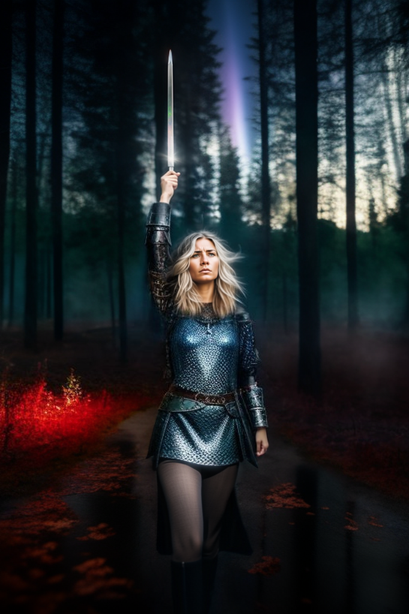

# Ведущая в битву

## Аннотация
Старые боги растворились во тьме веков, боевые подруги погибают одна за другой, а святые новой веры забирают всё внимание людей себе.  
Скольких сестёр она больше не увидит? Но лучше подумать о себе, ведь вторую смерть не пережить.  

## Темы
рассказ, фэнтези, Брунгильда, валькирия, викинги, Кощей, нежить, Полтава

## Объем
20к

## Написан
Декабрь 2020 - Январь 2021

## Конкурсы
Участник конкурса БС 13 на сайте litclubbs.ru
- https://litclubbs.ru/writers/6798-veduschaja-v-bitvu.html

## Текст на других платформах:
#### v1
- https://litclubbs.ru/writers/6798-veduschaja-v-bitvu.html
- https://dzen.ru/media/litclubbs/veduscaia-v-bitvu-651920c94115d078d18a21fa
#### v2
- https://telegra.ph/Vedushchaya-v-bitvu-10-05
- https://author.today/work/301059
- https://pikabu.ru/story/vedushchaya_v_bitvu_10724610

***

Вариант названия: Валькирия  

Я постарался сделать рассказ самостоятельным произведением. Однако, вы можете найти какое-то количество отсылок, заимствований и одно историческое событие.

Места действий охватывают культурное пространство викингов - Британию, собственно Скандинавию и Россию. Места куда они приходили не только с набегами, но и устраивали временные или постоянные поселения, вели торговлю, имели влияние.

Исторические периоды охватывают время от начала (или расцвета) викингов, до заката военного превосходства одних из их потомков - Шведов.

Брюнхильд (Брунгильда) - известный персонаж скандинаских саг. Её история с Зигфридом (Сигуртом) имеет отличия в зависимости от источника. Я так же внес некоторые изменения, чтобы вписать её в свою историю.

Хрустальный меч - непрактичное, хрупкое оружие. Он принадлежал святому, который буквально менял свойство материала. В руках валькирии клинок потерял многие свои свойства. Но всё ещё мог использоваться в качестве оружия против простых смертных. Однако, против равного противника он не выстоял.

Скелет с золотым мечом - Кощей бессмертный. Каждой культуре свои герои (антигерои). Я постарался показать, что он вписался в общество (в начале он выглядит как обычный офицер). Но при этом сохранил свою суть, и сопровождает армию для утоления собственного голода.

Поскольку по законам древних богов валькирия не может быть замужней, после смерти/обращения она потеряла всякую возможность увидеть мужа. В саге о Нибелунгах Зигфрид разрубает кольчугу околдованной валькирии и таким образом освобождает ее ото сна. Здесь же, золотой меч прорубает кольчугу валькирии, и лишает ее магических сил.

Потеря сил разрывает брачный запрет, что приводит к финальной сцене с воссоединением. Почему прошли десятки лет, или даже века? Возможно, Зигфриду требовалось время. Тот ли этот Зигфрид, его ли реинкарнация, по сути не важно, поскольку и сама Брунгильда перерождалась и уже не та, что раньше.

Зигфрид в кустах и нагая Брунгильда в воде - аналогично знакомству ее дочери Аслауг с Рагнаром.

В рассказе использованы две фразы из двух песен:

1. Валькирия (группа Ветер Воды).

2. Полтава (группа Сабатон, русский перевод).

Полтавская битва. Эта часть рассказа безусловный лидер по количеству специфических слов. Здесь я постарался не соврать с ходом битвы и тактикой подразделений. Но это сказалось на восприимчивости текста.