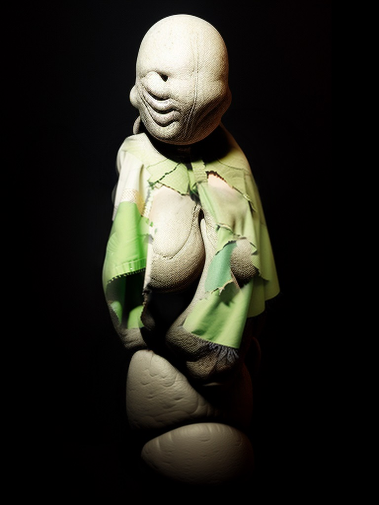

# Лугун ал Упуш

## Аннотация
Какие-то космические аборигены требуют выучить ритуальную речь на их языке? Да что они себе позволяют?!  
Мо жабажан лугун ал Упуш... к чёрту, выпью бренди.  

## Темы
рассказ, фантастика, юмор, инопланетяне, дипломатия, вымышленные языки, другая планета

## Объем
10к

## Написан
Март 2022

## Конкурсы
Участник конкурса Фанты-2 на сайте litbes.com  
Опубликован в интернет-журнале "Молоко".  
#### v1
- https://litbes.com/concourse/fnt-2-18/

## Текст на других платформах:
#### v1
- http://moloko.ruspole.info/node/15959
- https://cont.ws/@DiZu/2640968/full
- https://litbes.com/concourse/fnt-2-18/
#### v2
- https://author.today/work/301398
- https://telegra.ph/Lugun-al-Upush-10-07
- https://pikabu.ru/story/lugun_al_upush_10736631

***

Вариант названия: Фатальная ошибка  

Субмангулы оллрдосу лимсь до человечество. Оул галилису...  
Пожелание мира (субмангулы) всевозможные (All -> олл+рдосу) прислано (лимсь) от (до) человечества. Наше уважение (гал-смех ил-совместный ису-с вами, исю-над вами)  
Человечество шлет вам все возможные желания мира. Наше уважение...  
  
Мо жабажан лугун ал Упуш...  
Я (мо) наделен правом (жабажан) приветствие (лугун) к Упуш.  
Я уполномочен приветствовать Упушей.  
  
Оллису ал виту межо оур полус.  
Пусть будет вся (от All-все, будет) ал (к, по направлению) жизнь (vita) между нашими (our) народами (populus)  
  
Лленофа оур шилия.  
Обновим (ренова) наши (оур) отношения (релейшнШИП + отношеИЯ). Давайте проведем ритуал посвещения во взрослую жизнь!  
  
Оллису одулту литурия эмтиат ал виту!  
Пусть будет взрослый (от. old) ритуал (литургия) посвещения (инициация, initiatio -> emtiat) в жизнь  
Давайте проведем ритуал посвещения во взрослую жизнь  
  
Оллису одултум литурия эмтиат ал витуил!  
-м -признак власти, одултум взрослый и с властью  
-ил -совместный, витуил - совместная жизнь  
Давайте проведем ритуал посвещения в совместную жизнь властных взрослых.  